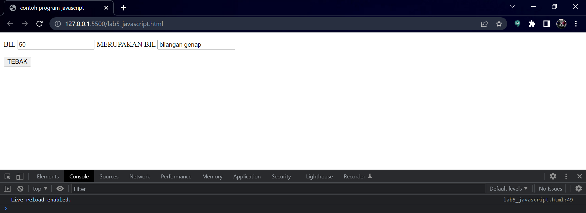
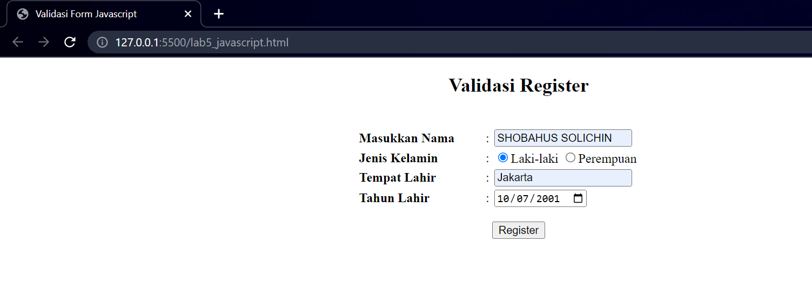

## **Langkah-langkah Praktikum**
Persiapan membuat dokumen HTML dengan nama file `lab5_javascript.html` seperti berikut.
```html <br>
<!DOCTYPE html>
<html lang="en">
<head>
    <title>Mengenal JavaScript</title>
</head>
<body>
    <h1>Pengenalan JavaScript</h1>
    <h3>Contoh document.write dan console.log</h3>
    <script>
        document.write("Hello World");
        console.log("Hello World");
        </script>
</body>
</html>
```
Hasilnya 


## **Javascrip Dasar**
Pemakaian Alert sebagai property window.

```html <br>
<!DOCTYPE html>
<html lang="en">
    <head>
        <title>Alert box</title>
    </head>
    <body>
        <script language = "javascript">
            <!--
                window.alert("ini merupakan pesan untuk anda");
                //-->
        </script>
    </body>
</html>
```


## **Pemakaian method dalam objek**

```html <br>
<!DOCTYPE html>
<html lang="en">
    <head>
        <title>skrip javascript</title>
    </head>
    <body>
        <script language = "javascript">
            <!--
               document.write("selamat mencoba javascript <br>");
               document.write("semoga sukses");
                //-->
        </script>
    </body>
</html>
```


## **Pemakaian Prompt**
```html <br>
<!DOCTYPE html>
<html lang="en">
    <head>
        <title>pemasukan data</title>
    </head>
    <body>
        <script language = "javascript">
            <!--
               var nama= prompt("siapa nama anda?","masukan nama anda");
               document.write("hai,"+ nama);
                //-->
        </script>
    </body>
</html>
```
lalu lihat hasilnya


## **Pembuatan fungsi dan cara pemanggilannya**

```html <br>
<!DOCTYPE html>
<html lang="en">
    <head>
        <title>contoh program javascript</title>
        <script language = "javascript">
            function pesan() {alert ("memanggil javascript lewat body onload")
        }    
        </script>
    </head>
    <body onload=pesan()>
    </body>
</html>
```
lalu lihat hasilnya 


## **Dasar Pemrograman Di Javascript**
Operasi dasar aritmatika
```html <br>
<!DOCTYPE html>
<html lang="en">
    <head>
        <title>contoh program javascript</title>
        <script language = "javascript">
            function test(val1,val2)
            {
                document.write("<br>"+"perkalian : val1*val2"+"<br>")
                document.write(val1*val2)
                document.write("<br>"+"pembagian : val1/val2"+"<br>")
                document.write(val1/val2)
                document.write("<br>"+"penjumlahan : val1+val2"+"<br>")
                document.write(val1+val2)
                document.write("<br>"+"pengurangan : val1-val2"+"<br>")
                document.write(val1-val2)
                document.write("<br>"+"modulus : val1%val2"+"<br>")
                document.write(val1%val2)
            }   
        </script>
    </head>
    <body>
        <input type="button" name="button1" value="arithmwtic" onclick=test(9,4)>
    </body>
</html>
```
Lalu lihat hasilnya


Seleksi kondisi (if..else
```html <br>
<!DOCTYPE html>
<html lang="en">
    <head>
        <title>contoh if-else</title>
        <script language = "javascript">
            <!--
            var nilai= prompt("nilai (0-100): ",0);
            var hasil ="";
            if (nilai >=60)
            hasil = "lulus";
            else
            hasil + "tidak lulus";
            document.write("hasil: " + hasil);
            //-->
        </script>
    </head>
    </body>
</html>
```
lalu lihat hasilnya


## **Penggunaan operator switch untuk seleksi kondisi**
```html <br>
<!DOCTYPE html>
<html lang="en">
    <head>
        <title>contoh program javascript</title>

        <script language="javascript">
            function test()
            {
                val1=window.prompt("input nilai (1-5):")
                switch (val1)
                {
                    case "1" :
                        document.write("bilangan satu")
                        break
                    case "2" : 
                        document.write("bilangan dua")
                        break
                    case "3" : 
                        document.write("bilangan tiga")
                        break
                    case "4" : 
                        document.write("bilangan empat")
                        break
                    case "5" :
                        document.write("bilangan lima")
                        break
                     default : 
                        document.write("bilangan lainnya")

                }
            }
        </script>
    </head>
<body>
    <input type="button" name="button1" value="switch" onclick=test()>
</body>
</html>
```
lalu lihat hasilnya 


## **Pembuatan For**
Form Input
```html <br>
<!DOCTYPE html>
<html lang="en">
    <head>
        <title>contoh program javascript</title>
        <script language = "javascript">
            function test () {
                var val1=document.kirim.T1.value
                if (val1%2==0)
                document.kirim.T2.value="bilangan genap"
                else
                document.kirim.T2.value="bilangan ganjil"
            }
        </script>
    </head>
    <body>
        <form method="POST" name="kirim">
            <p>BIL <input type="text" name="T1" size="20">
                MERUPAKAN BIL <input type="text" name="T2" size="20"></p>
            </p><input type="button" value="TEBAK" name="B1" onclick=test()></p>
        </form>
    </body>
</html>
```
lalu lihlah hasilnya




Form Button
```html <br>
<!DOCTYPE html>
<html lang="en">
    <head>
        <title>objek document</title>
    </head>
    <body>
        <script language = "javascript">
            <!--
                function ubahWarnaLB(warna) {
                    document.bgColor = warna;
                }
                function ubahWarnaLD(warna) {
                    document.fgColor = warna;
                }
                //-->
        </script>

        <h1>tes</h1>
        <form>
            <input type="button" value="Latar Belakang Hijau" onClick="ubahWarnaLB('GREEN')">
            <input type="button" value="Latar Belakang Putih" onClick="ubahWarnaLB('WHITE')">
            <input type="button" value="Teks Kuning" onClick="ubahWarnaLD('YELLOW')">
            <input type="button" value="Teks Biru" onClick="ubahWarnaLD('BLUE')">
        </form>
        <script language ="javascript">
            <!--
                document.write("Dimodifikasi terakhir pada " + document.lastModified);
                //-->
        </script>
    </body>
    </html>
```


## **HTML DOM**
Pilihan menggunakan checkBox dengan perhitungan otomatis
```html <br>
<!DOCTYPE html>
<html lang="en">
    <head>
        <title>Daftar menu</title>
        <script>
            function hitung(ele) {
                    var total = document.getElementById.value;
                    total = (total ? parseInt (total) : 0);
                    var harga = 0;
                    if (ele.checked) {
                        harga = ele.value;
                        total += parseInt(harga);
                    }else {
                        harga = ele.value;
                        if (total > 0)
                        total -= parseInt(harga);
                    }
                    document.getElementById('total').value = total;
                }
        </script>
    </head>
    <body>
        <h1>Daftar Menu Makanan</h1>
            <input type="checkbox" value="5000" id="menu1" onclick="hitung('this');" /> Ayam Goreng Rp.5000</label><br />
            <input type="checkbox" value="500" id="menu2" onclick="hitung('this');"/> Tempe Goreng Rp.500</label><br />
            <input type="checkbox" value="2500" id="menu3" onclick="hitung('this');" /> Telur Dadar Rp.2.500</label><br />
          <strong>Total Bayar: Rp. <input id="total" type="text"/></strong>
    </body>
    </html>
```
lalu lihat hasilnya


## **Pertanyaan dan Tugas**

# 1. Buat script untuk melakukan validasi pada isian form.

## **Jawab**

1.Kta buat htmlnya sebagai berikut
```html
<!DOCTYPE html>
<html>
<head>

<title>Validasi Form Javascript</title>
</head>
<body>
  <center>
    <h2>Validasi Register</h2>
  </center>  
  <br/>
<form action="" method="post" onSubmit="return validasi_data(this)">
<table border="0" width="400" align="center">
  <tr>
    <th align="left">Masukkan Nama</th>
    <td>:</td>
    <td><input type="text" name="nama" id="nama"></td>
  </tr>
    <tr>
    <th align="left">Jenis Kelamin</th>
    <td>:</td>
    <td><input type="radio" name="jeniskelamin" value="L" id="jeniskelamin" checked="checked">Laki-laki
        <input type="radio" name="jeniskelamin" value="P">Perempuan</td>
  </tr>
    <tr>
    <th align="left">Tempat Lahir</th>
    <td>:</td>
    <td><input type="text" name="tempat" id="tempat"></td>
  </tr>
    </tr>
    <tr>
    <th align="left">Tahun Lahir</th>
    <td>:</td>
    <td><input type="date" name="tgl" id="tgl"></td>
  </tr>
  <tr>
    <td colspan="3" align="center" height="50"><input type="submit" name="" id="" value="Register"></td>
  </tr>
</table>
</form>
</body>
</html>
```

Tempatkan javascript tersebut tepat dibawah </body> yang nantinya. Script secara keseluruhan akan seperti berikut ini
```html
<script type="text/javascript">
  function validasi_data(form) {  
    if (form.nama.value=="") {
      alert('nama  harus di isi !');
      form.nama.focus();
      return false;
    }else if(form.tempat.value=="") {
      alert('Tempat Lahir harus di isi !');
      form.tempat.focus();
      return false;
    }
  }
</script>
```
Hasil Outputnya


Jika datanya diisinya semua


